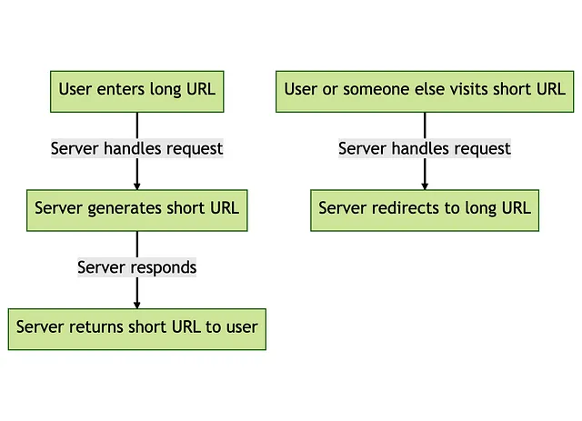

# A Fun Adventure with Go, Gin, & PostgreSQL TO Shorten URls

URL shorteners are the unsung heroes of the internet, reducing lengthy, untamed URLs into nice, tidy ones that are easy to share and remember. Have you ever utilized Bitly or TinyURL? Those are URL shorteners, to be sure.

## Getting Started

We want to shorten over 500,000 URLs every day and receive around two million visits. Doesn't it seem intimidating? But don't worry! Every second, there are around 6 URLs to shorten and 24 visits to process. It's a piece of cake!

## A Deep Dive into Design
### Big Picture: Our Design

Before we dive into the deep end, let’s get a lay of the land. Our URL shortener will do two things:
* URL Shortening: Take a long URL, squish it into a short URL.
* URL Redirection: Take that short URL and guide anyone who clicks on it to the original long URL.

Here’s a simple flowchart to help visualize:

<p align="center">
  
</p>

### Let's Talk Numbers

First and foremost, we must comprehend our storage requirements. If we assume that each URL mapping item in our database takes up around 500 bytes (250 bytes for the long URL, 20 bytes for the short URL, and 230 bytes for PostgreSQL's overhead), we'll require approximately 250MB of storage every day. Over the course of a year, that equates to around 90GB. Not bad at all!

In terms of bandwidth, every time we shorten a URL, we send the long URL up to the server and receive the short one back. Each conversion takes roughly 270 bytes if the average long URL is 250 bytes and the short URL is 20 bytes. Multiply it by our 0.5 million daily conversions and you get 135MB each day, or 50GB per month.year. Easy peasy!

As for redirection, it’s virtually nothing. We’re just sending the short URL to the server and getting back a HTTP 301 redirect.

### Prerequisites

First, we need to set up our toolbox. We’re using:

* Golang : You can grab Go from the official [Go website](https://golang.org/dl/)
* Gin
* PostgreSQL.
* Gorm

### Setting Up the Environment

A step by step guide that will tell you how to get the development environment up and running.

```
$ go get github.com/gin-gonic/gin.
$ go get github.com/jinzhu/gorm
$ go get gorm.io/driver/postgres
```

### Our Trusty Database

Our database is super simple:

```
type Model struct {
	ID        uint64    `gorm:"column:id;primary_key;auto_increment;" json:"id"`
	CreatedAt time.Time `gorm:"column:created_at;type:datetime;not null;" json:"created_at"`
	UpdatedAt time.Time `gorm:"column:updated_at;type:datetime;not null;" json:"updated_at"`
}

type URL struct {
	Model
	LongURL  string `gorm:"column:long_url;" json:"long_url"`
	ShortURL string `gorm:"column:short_url;" json:"short_url"`
}

```

## Base62 Encoding and Decoding

Base62 is our secret sauce to keep our URLs short. Why 62? Because we’re using 26 lowercase letters, 26 uppercase letters, and 10 digits. This gives us a whopping 56 billion possibilities for 6-character strings.

We can convert the id of a URL record into a base62 string (our encoding function), and we can also convert a base62 string back into an integer (our decoding function).

```
// characters used for Base62 encoding
const base62Chars = "0123456789abcdefghijklmnopqrstuvwxyzABCDEFGHIJKLMNOPQRSTUVWXYZ"
func base62Encode(num int) string {
    encoded := ""
    for num > 0 {
        remainder := num % 62
        num /= 62
        encoded = string(base62Chars[remainder]) + encoded
    }
    return encoded
}
func base62Decode(str string) int {
    decoded := 0
    for i := 0; i < len(str); i++ {
        pos := strings.Index(base62Chars, string(str[i]))
        decoded += pos * int(math.Pow(62, float64(i)))
    }
    return decoded
}
```

## Wrapping Up

That's all there is to it! We created a URL shortener that can manage huge traffic, delivers informative error messages, verifies URLs, and improves performance through caching. Isn't it incredible what we can accomplish with Go, Gin, and PostgreSQL?

Keep in mind that this is a minimal implementation. There are several methods to improve it, such as including user authentication, tracking click analytics, and employing a distributed cache for increased scalability.


